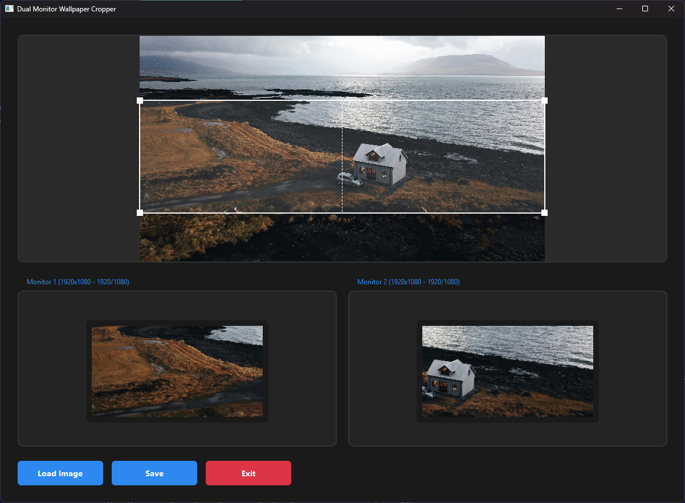

# WallCrop

A modern, portable application for effortlessly cropping and splitting wallpapers across dual monitors. Features an intuitive drag-and-drop interface with real-time preview.

## ✨ Features

- **Portable**: No installation required - just download and run!
- **Interactive Interface**: Intuitive drag-and-drop controls with resize handles
- **Real-time Preview**: See exactly how your wallpaper will look on both monitors
- **Aspect Ratio Lock**: Automatically maintains correct monitor proportions
- **Modern Design**: Clean, dark theme interface
- **Monitor-Aware**: Automatically detects your monitor configuration

## 🚀 Getting Started

1. Download the latest release from the [Releases](https://github.com/bintangtimurlangit/wallcrop/releases) page
2. Extract the zip file
3. Run `wallcrop.exe`
4. Start cropping your wallpapers!

## 🎯 How to Use

1. Click "Load Image" or drag an image file into the window
2. Adjust the crop area using the corner/edge handles
3. Move the entire selection by dragging from the center
4. Use the real-time previews to check your positioning
5. Click "Save" to export wallpapers for each monitor

## 🛠️ Planned Improvements

Current development goals:

1. Drag and drop interface for loading images
2. Support for three-monitor setups
3. Custom aspect ratio options
4. Automatic wallpaper application

Additional suggestions:
1. Hotkey support for fine-tuning crop area
2. Preset profiles for common monitor configurations
3. Batch processing for multiple wallpapers
4. Quick-save to common wallpaper directories
5. Undo/redo functionality
6. Image adjustment tools (brightness, contrast, etc.)
7. Export presets (quality, format options)
8. Wallpaper rotation/scheduling support
9. Monitor bezel compensation
10. Save/load crop configurations

## 🤝 Contributing

Contributions are welcome! Feel free to:
- Report bugs
- Suggest features
- Submit pull requests

## 📝 License

This project is licensed under the MIT License - see the [LICENSE](LICENSE) file for details.
